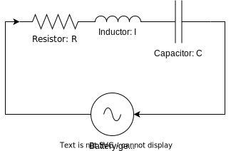

# DSECOP ---: Parameter Estimation of RLC Circuit Model with Automatic Differentiation and Gradient Descent
Connor Robertson

## Summary
This module is meant to give a gentle introduction to computational tools for estimating parameters in differential equations.
Specifically, the goal is to teach students about automatic differentiation and use it in conjunction with gradient descent, both of which are enormously important tools in data science.
As a test case, these tools are applied to simulated data collected from an RLC circuit which makes the module well suited to a course in electronics.
The module is split into two submodules:

- **Notebook 1** (1 hr): Simulating an RLC circuit model and estimating unknown parameters with gradient descent and finite differences
- **Notebook 2** (1 hr): Automatic differentiation and how it can be applied to improve the parameter estimation from notebook 1

 

  

The second submodule builds on the previous to be understood.
Each submodule contains 3-4 programming questions that allow the students to modify example code to better understand how the program in these contexts and to explore the effects of different approaches.

## Learning Goals
Python packages that students will use for goals are listed `as such`.

### Physics
- To be able to understand the translation of an in-series RLC circuit diagram to a differential equation via Kirchoff's Law
- To be able to simulate the current through an RLC circuit over time (`scipy`)
- To understand the influence of resistance, inductance, and capacitance on the current

### Data Science

- To be able to formulate a loss function that encapsulates their goal
- To be able to use finite differences to approximate derivatives of data
- To be able to use gradient descent to iteratively improve values to minimize the loss
- To understand and be able to implement simple automatic differentiation
- To use automatic differentiation in gradient descent (`jax`, `pytorch`)
- To be able to visualize their optimization in animated form (`matplotlib`)

## Prerequisites
- Python programming as listed in the [core prerequisites](https://github.com/GDS-Education-Community-of-Practice/DSECOP/wiki/Core-prerequisites)
- Students will require familiarity with Kirchoff's Law, calculus, and ordinary differential equations

Additionally, a basic understanding of numerical solutions to differential equations is helpful.

## Setup Instructions

***Instructions for setting up the COLAB environment***

Click on "Open in Colab" button on any notebook in this repository.
This will run the notebook on Google Colab.

***Instructions for setting up the LOCAL environment***
To set up the environment with conda:

1. Create new environment using the `environment.yml` file in this repository:
`conda env create -f environment.yml`
2. Activate the env:
`conda activate autodiff`
3. Run `jupyter notebook` in this directory. A browser window will open where the notebooks can be viewed.

## Additional Ideas
The tools presented in this module are generally applicable to almost any system that has parameters in it.
A couple of fun extensions that could be considered for projects or interesting applications are:

- Collecting real data from an in series RLC circuit then applying these tools to that data!
- Using automatic differentiation as a tool to quantify error propogation. See [here](https://kitchingroup.cheme.cmu.edu/blog/2018/11/05/Using-autograd-for-error-propagation/) for an example of how this could be done.
