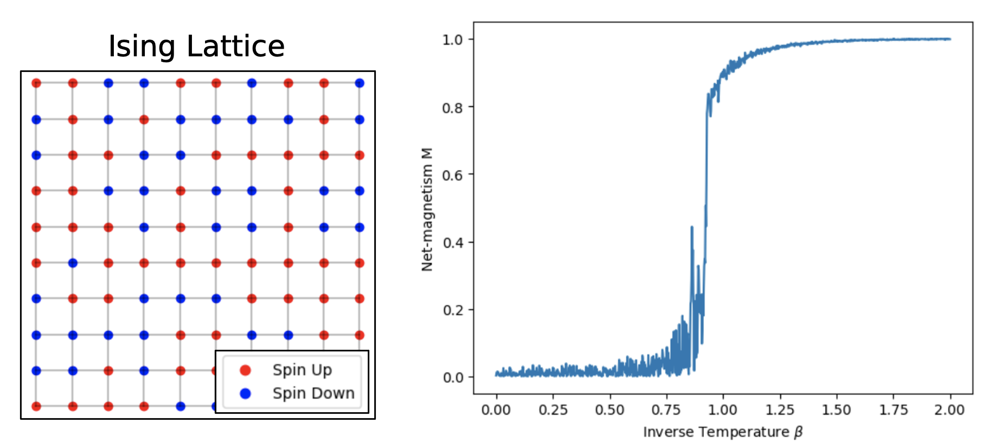

# Module Summary

This module will connect classical Monte Carlo (MC) simulations to modern machine learning methods. Students will learn to implement Metropolis-Hastings Algorithm Ising Model simulations to generate their own 2D magnetic domain image set, then use supervised and unsupervised machine learning techniques to perform additional analysis.  Three notebooks are presented: The first is an introduction to Monte Carlo methods and Markov chains; students learn the difference between a model and a simulation, then implement basic MC integration of a differential physics equation to approximate the area under a curve.  The second notebook introduces the 2D Ising Model and the Metropolis-Hastings algorithm by teaching students how to implement the algorithm on the CPU with NumPy libraries, and GPU with TensorFlow; students will learn basic algorithm optimization techniques and generate a labeled image set of Ising lattices suitable for further analysis.  The third notebook introduces supervised machine learning techniques; students will reverse the task from the second notebook and instead of simulating Ising lattices at a given temperature, predict a temperature for a given Ising lattice.

### Key Words

Ising-model, Monte Carlo simulations, Markov Chains, image processing, clustering, Deep-Neural-Networks, TensorFlow, NumPy

### Courses
These notebooks are recommended for undergraduate courses in thermodynamics, solid-state physics, and computational physics, or a lab course with a computational component.

### Background Knowledge

Students should be familiar with basic probability and have beginning knowledge of a scripting language (e.g., Python, MATLAB, R, etc.).

### Estimated Amount of Time

Suggested time is 2-3 hours per notebook; total time for the module can be between 1-10 hours split between active learning during a lecture period and at-home assignments.  Notebook 1 is optional background information; subsequent notebooks do not depend on Notebook 1 content or calculations.  It is suggested that first half of Notebook 2 be completed in class to provide adequate background on the Ising Model; the second half of the notebook to be assigned as homework.  Notebook 3 depends on Notebook 2, and is suggested homework after completing Notebook 2.

# Notebook Summary (Course Alignment Map)

|Notebook Title|Description|Data Science Learning Goals|Physics Learning Goal|
|--------------|-----------|---------------------------|---------------------|
|N1. Introduction to Monte Carlo Methods and Markov Chains | Introduces students to the difference between simulation and modeling, walks them through the steps of simulating a physical model and evaluating it.  Recommended to be assigned as homework before the next notebook.  Total Time: 1.5 hrs| DG1. Define the difference between a model and a simulation  DG2. Define a Markov Chain  DG3. Name three error metrics.|PG1. Given a physics equation, approximate the definite integral value through Monte Carlo integration.   PG2. Given a Markov Chain, simulate the state transitions using Monte Carlo sampling.  PG3. Calculate the error between a simulation and the analytical result.|
|N2. 2D Ising Model | Introduces students to the derivation for the Ising Model, and walks them through a 2D simulation of a square Ising lattice.  Students are taught to identify the parts of the algorithm which are compute-intensive, and basic complexity and optimization skills for python code.    Total Time: 1 hr| DG1. Implement the Metropolis-Hastings algorithm in Python using `numpy`.  DG2. Implement basic timing methods for understanding code execution.   DG3. Implement `numba` to improve code timing. | PG1. Understand the origin of the Ising Model and ferromagnetism.   PG2. Simulate net-magnetization curves as a function of temperature for a 2D system.   PG3. Connect the phase transition from magnetic disorder to order with the formation of magnetic domans in a thermalized system.|
|N3. Predicting the Inverse Temperature of a Lattice|Students use three different non-linear models to predict the temperature at which an Ising lattice was simulated.     Total Time: 1.5 hrs active work; 6 hrs total background computation | DG1. The difference between linear/non-linear regression and Deep Neural Networks  DG2. The Universal Approximation Theorem   DG3. How to implement a Fully-connected Deep Neural Network (FC-DNN) for regression of 1D data   DG4. How to implement a Convolutional Neural Network (CNN) for regression of 2D data|PG1. How to select the correct model for experimental physics data   | 
