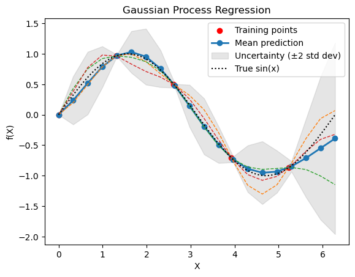
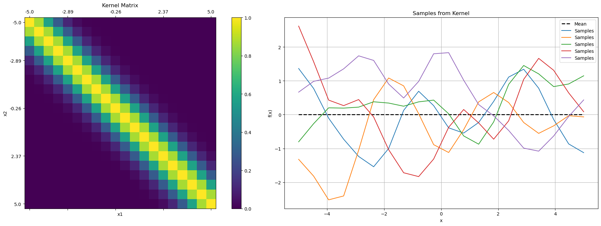
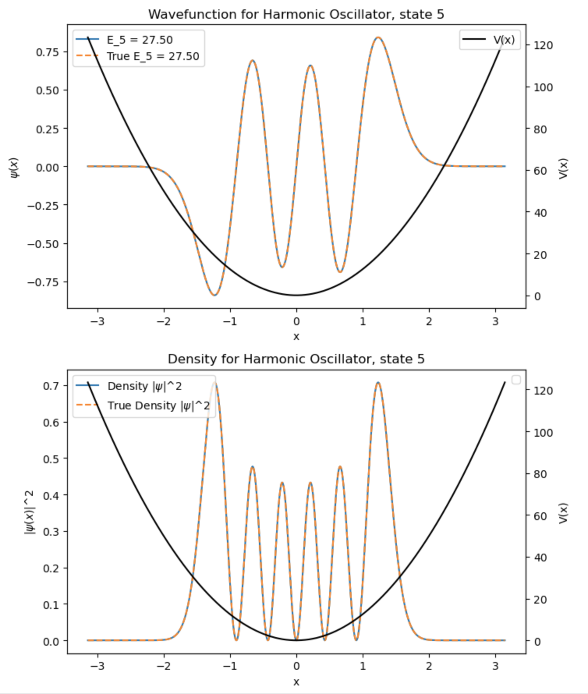

# DSECOP 236 Gaussian Processes and the Schrödinger Equation 
Author: Karan Shah

- **Summary**: This module targets a Quantum Mechanics or Computational Physics course, focusing on the time-independent Schrödinger Equation (TISE). It introduces students to Gaussian Processes (GPs) as a tool for estimating ground state energies of model quantum systems under varying potentials, offering an alternative to traditional numerical methods. The module includes a theoretical overview of TISE and GPs, followed by hands-on exercises where students apply GPs to solve TISE for various potential wells.



The module is structured as follows:
- 01: Detailed exploration of the time-independent Schrödinger Equation, including potential functions and boundary conditions.
- 02: Introduction to Gaussian Processes, building up intuition from the already known Gaussian distribution to Gaussian Processes.
- 03: A notebook demonstrating the application of GPs to solve TISE for various potentials. (WIP: The notebook is static right now with some results. Making it interactive with code used in the previous notebooks.)



- **What is included in this module?**:
    - Interactive notebooks
    - Step-by-step implementation of numerical solvers and Gaussian Processes
    - Exercises with varying levels of complexity
    - Project suggestions that encourages students to explore the application of GPs to novel potential functions.

- **Applicable Courses**:
    - Quantum Mechanics
    - Computational Physics
    - Mathematical Methods for Physicists



- **Learning Goals**:
    - Physics: Deepen understanding of the time-independent Schrödinger Equation, emphasizing analytical vs. numerical solutions. This module is ideally introduced after students are familiar with basic quantum mechanics and before delving into time-dependent problems.
    - Data Science: Introduce Gaussian Processes as a powerful tool for regression and solving differential equations, showcasing their utility in physics for obtaining precise solutions to complex problems without explicit analytical forms.

- **Estimated Completion Time**:
    - For students: 6 hours
    - For instructors: 2 hours

- **Prerequisites**:
    - Core prerequisites as listed in the [DSECOP Core Prerequisites](https://github.com/GDS-Education-Community-of-Practice/DSECOP/wiki/Core-prerequisites)
    - Basic understanding of Quantum Mechanics and Probability
    - Introductory knowledge of machine learning, beneficial but not mandatory

- **Related modules**:
    - DSECOP 140 [Machine Learning Workflow](https://github.com/GDS-Education-Community-of-Practice/DSECOP/tree/main/Machine_Learning_Workflow) by Julie Butler (2022)
    - DSECOP 230 [Solving Differential Equations with NNs](https://github.com/GDS-Education-Community-of-Practice/DSECOP/tree/main/Solving_Differential_Equations_with_NNs) by Julie Butler (2022)
    - DSECOP 235 [Learning the Schrodinger Equation](https://github.com/GDS-Education-Community-of-Practice/DSECOP/tree/main/Learning_the_Schrodinger_Equation) by Karan Shah (2022)

***Setting Up the Environment***

**Google Colab:**

- Access notebooks directly with "Open in Colab" buttons.
- Use a GPU for optimal performance: "Runtime" > "Change Runtime Type" > "Hardware Accelerator" > "GPU".

**Local Environment with Conda:**

- Create a new environment: `conda create -n dsecop_tise python=3.11`
- Activate the environment: `conda activate dsecop_tise`
- Install dependencies:
```
conda install numpy scipy matplotlib jupyter ipywidgets
```
- Launch Jupyter Notebook: `jupyter notebook`

- **References**:
    1. Carl Edward Rasmussen and Christopher K. I. Williams. Gaussian Processes for Machine Learning. The MIT Press, 2006.
    
