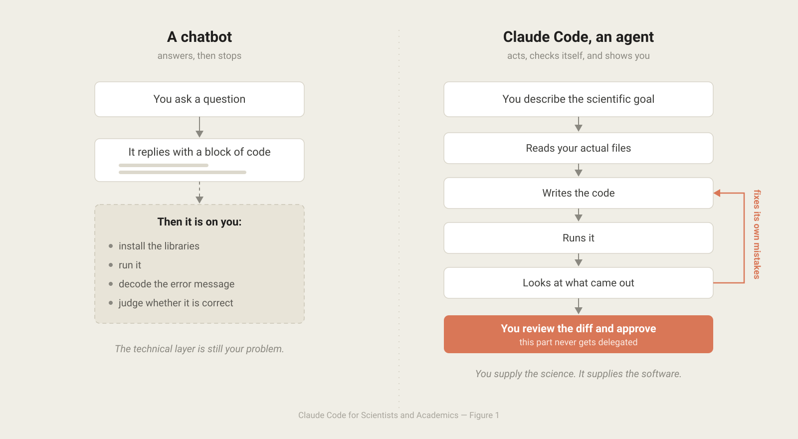
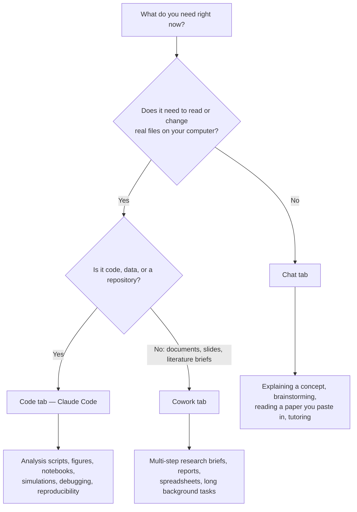
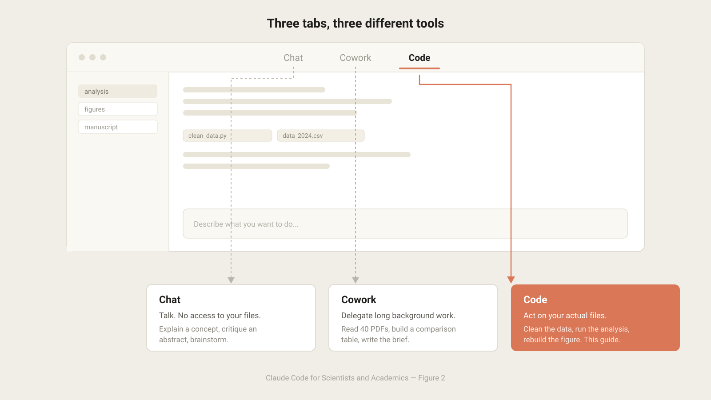
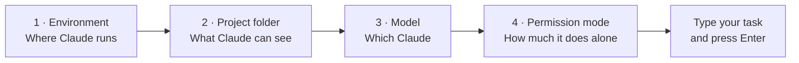
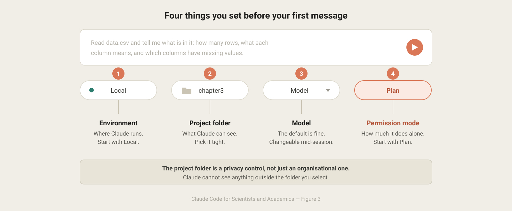
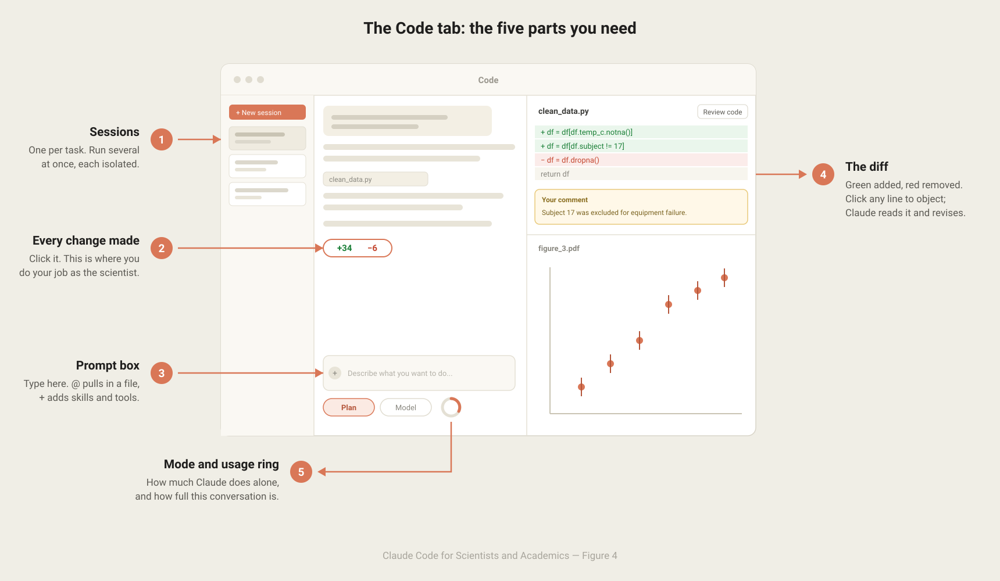
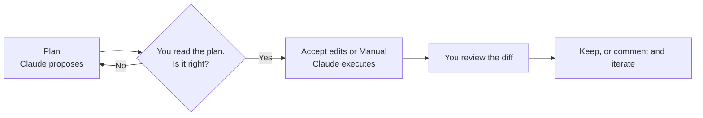
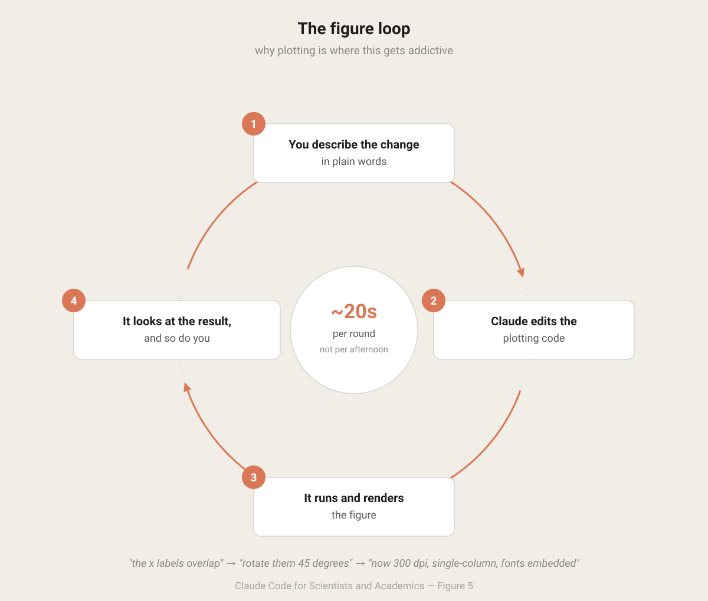
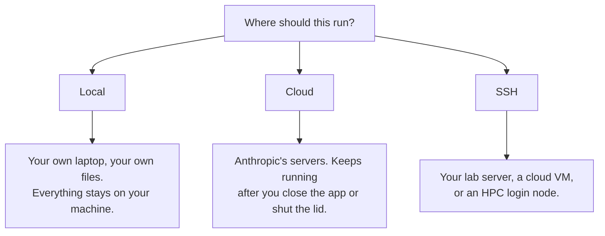
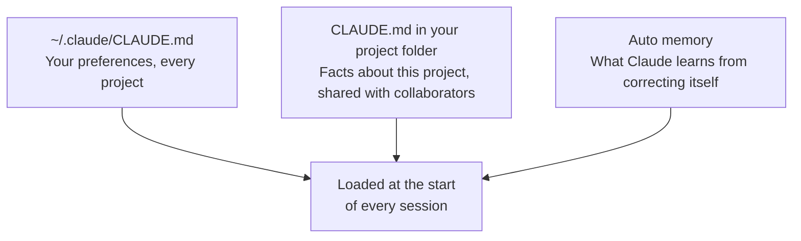

<h1 align="center">Claude Code for Scientists and Academics</h1>

<p align="center">
  <i>A guide for researchers who are not programmers.</i><br>
  <sub>No terminal. No prior Python. No command line. Just your research.</sub>
</p>

<p align="center">
  <a href="https://claude.com/download"></a>
  <a href="https://code.claude.com/docs"></a>
  <a href="https://www.anthropic.com/science"></a>
  <a href="https://claude.com/solutions/education"></a>
</p>

---

## Before you start

This guide teaches you **Claude Code**, the part of the Claude desktop app that can read, write, and run the files on your own computer — analysis scripts, data files, notebooks, manuscripts, simulation code.

**What you need to know already:** how to open an app, how to find a folder on your computer, and what your research question is.

**What you do *not* need to know:** the command line, Git, Python, or how to install software libraries. This guide will not teach you those things, and you do not need them. Claude Code exists precisely so that the technical layer stops being the barrier between you and your data.

> [!IMPORTANT]
> Claude Code is included in the Claude desktop app on a **Pro, Max, Team, or Enterprise** plan. See [plans and pricing](https://claude.com/pricing). Many universities now provide institutional access — check with your department before paying personally, and see [Claude for Education](https://claude.com/solutions/education) and the [Team plan for research labs](https://claude.com/programs/claude-team-plan-for-research-labs).

---

## Contents

| | Section | What you get |
|---|---|---|
| 1 | [What Claude Code actually is](#1-what-claude-code-actually-is) | The mental model, and which of the three tabs to use |
| 2 | [Setup in ten minutes](#2-setup-in-ten-minutes) | Install and sign in, no terminal |
| 3 | [Your first session](#3-your-first-session) | Four dropdowns, one sentence, first result |
| 4 | [The screen, explained](#4-the-screen-explained) | Every part of the window, in plain language |
| 5 | [Permission modes: the safety dial](#5-permission-modes-the-safety-dial) | How much you let Claude do on its own |
| 6 | [Research workflows](#6-research-workflows) | Ten worked patterns from real academic work |
| 7 | [Teaching Claude about your project](#7-teaching-claude-about-your-project) | So you stop re-explaining yourself |
| 8 | [Extending Claude Code](#8-extending-claude-code) | Skills, plugins, and connectors |
| 9 | [Ten habits that decide your results](#9-ten-habits-that-decide-your-results) | The difference between useful and useless |
| 10 | [Scientific integrity and your data](#10-scientific-integrity-and-your-data) | Verification, privacy, disclosure |
| 11 | [When something goes wrong](#11-when-something-goes-wrong) | Fixes for the common failures |
| 12 | [Plain-language glossary](#12-plain-language-glossary) | Every jargon term used above |
| 13 | [Where to go next](#13-where-to-go-next) | A curated map of Anthropic's resources |
| A | [Prompt recipe cards](#appendix-a-prompt-recipe-cards) | Copy, paste, adapt |
| B | [The figures](#appendix-b-the-figures) | How they are built, and how to change them |

---

## 1. What Claude Code actually is

### 1.1 The one-sentence version

**Claude Code is a research assistant that can open your files, write and run code, look at the result, and fix its own mistakes — while you watch and approve.**

That last part matters. A chatbot gives you a block of code and wishes you luck. Claude Code takes the action itself: it opens your CSV, notices the date column is formatted three different ways, writes the cleaning step, runs it, sees the plot come out wrong, and corrects it. Anthropic's engineering team calls this being *agentic* — the ability to "read files, run commands, make changes, and autonomously work through problems," described in [Claude Code best practices](https://www.anthropic.com/engineering/claude-code-best-practices).

For a researcher, the practical translation is this:

> You describe the *scientific* goal. Claude handles the *software* to get there. You check the science.

<p align="center">
  
</p>

<p align="center"><sub><b>Figure 1</b> · Chatbot vs. agent — <i>A chatbot hands you code and stops. An agent closes the loop — and you stay on the approving end of it.</i></sub></p>

### 1.2 Three tabs: Chat, Cowork, and Code

When you open the Claude desktop app you will see three tabs across the top. They are genuinely different tools, and picking the wrong one is the most common early mistake.



| Tab | What it is | Reach for it when |
|---|---|---|
| **Chat** | Conversation, no file access — like [claude.ai](https://claude.ai) | "Explain the difference between a random-effects and fixed-effects model." "Critique this abstract." |
| **Cowork** | An autonomous background agent working in its own sandboxed environment on longer, document-shaped tasks | "Read these 40 PDFs and produce a comparison table of their sample sizes and effect estimates." |
| **Code** | Claude Code — direct, permissioned access to your actual project folder | "Take `raw_2024.csv`, clean it, and reproduce Figure 3 with the new subjects included." |

Anthropic's own walkthrough of the three tabs is here: [Navigating the Claude desktop app](https://claude.com/resources/tutorials/navigating-the-claude-desktop-app). The rest of this guide is about the **Code** tab.

<p align="center">
  
</p>

<p align="center"><sub><b>Figure 2</b> · The three tabs — <i>Picking the wrong tab is the most common early mistake. Code is the one with access to your files.</i></sub></p>

### 1.3 What this looks like in real science

This is not speculative. Anthropic's [How scientists are using Claude to accelerate research and discovery](https://www.anthropic.com/news/accelerating-scientific-research) documents concrete cases: a genome-wide association study that normally takes months completed in about 20 minutes; 450 wearable-sensor files from 30 participants analysed in 35 minutes, a task estimated at three weeks by hand. At MIT's Cheeseman Lab, a principal investigator reviewing Claude's interpretation of CRISPR knockout clusters reported the recurring experience of *"I didn't notice that one!"*

For heavier computational work, Anthropic's science blog post [Long-running Claude for scientific computing](https://www.anthropic.com/research/long-running-Claude) describes a researcher using Claude Code to build a differentiable cosmological Boltzmann solver from scratch, reaching sub-percent agreement with the established reference implementation in days rather than months. The techniques from that post are distilled into [§9](#9-ten-habits-that-decide-your-results) below — particularly the idea of giving Claude a **test oracle**, a known-correct result it can check itself against.

Anthropic maintains a dedicated [Science blog](https://www.anthropic.com/research/introducing-anthropic-science) publishing exactly this kind of workflow write-up, and an [AI for Science program](https://www.anthropic.com/news/ai-for-science-program) that grants API credits to researchers at research institutions.

---

## 2. Setup in ten minutes

### Step 1 — Download and install

| Your computer | Get it here |
|---|---|
| **Mac** (any model, Intel or Apple Silicon) | [Download for macOS](https://claude.ai/api/desktop/darwin/universal/dmg/latest/redirect) |
| **Windows** | [Download for Windows](https://claude.ai/api/desktop/win32/x64/setup/latest/redirect) |
| **Linux** (beta) | [Install instructions](https://code.claude.com/docs/en/desktop-linux) |

Or start from the single download page: **[claude.com/download](https://claude.com/download)**. If you have never installed an application before, the Claude Help Center has a step-by-step article with pictures: [Install Claude Desktop](https://support.claude.com/en/articles/10065433-install-claude-desktop).

> [!TIP]
> **You do not need to install Python, Node.js, or the Claude Code command-line tool.** The desktop app contains Claude Code already. This is stated directly in the [desktop quickstart](https://code.claude.com/docs/en/desktop-quickstart).

### Step 2 — Sign in and open the Code tab

Launch Claude, sign in with your Anthropic account, and click the **Code** tab at the top centre of the window.

If clicking **Code** asks you to upgrade, your plan does not include Claude Code yet — see [pricing](https://claude.com/pricing). If it asks you to sign in online, complete that and restart the app.

### Step 3 — Windows users only: install Git

On Windows, the Code tab requires **Git for Windows**. Download it from [git-scm.com/downloads/win](https://git-scm.com/downloads/win), run the installer accepting all defaults, and restart Claude.

You will never have to *use* Git yourself. Claude Code uses it underneath to keep a safety net of your file history so that changes can always be undone. Most Macs already have it.

---

## 3. Your first session

A **session** is one conversation about one piece of work. It has its own history and its own set of changes, independent of every other session. You will end up running several at once eventually; start with one.

### 3.1 The four things you set before you type

Before your first message, four controls sit around the prompt box. Set them once and you can forget them.



| Control | Set it to | Why |
|---|---|---|
| **Environment** | **Local** | Runs on your own laptop, using your real files. This is what you want to start. ([Cloud and SSH](#69-long-jobs-cloud-sessions-and-your-lab-server) come later.) |
| **Project folder** | Click **Select folder** and choose the folder holding your project | Claude can only see inside this folder. Choosing a tight folder is a privacy control, not just an organisational one. |
| **Model** | The default | You can change it mid-session from the dropdown next to the send button. |
| **Permission mode** | **Plan** for your first task | Claude will explore and propose an approach *without changing a single file*. See [§5](#5-permission-modes-the-safety-dial). |

> [!TIP]
> **Which folder should I pick?** The folder that contains the thing you are working on and nothing sensitive that is unrelated. If your analysis lives in `Documents/thesis/chapter3/`, pick that — not your entire `Documents` folder.

<p align="center">
  
</p>

<p align="center"><sub><b>Figure 3</b> · The four controls around the prompt box — <i>Set these once. The project folder is the one that also functions as a privacy boundary.</i></sub></p>

### 3.2 Type one sentence

Good first tasks are ones where you already know the answer, so you can judge the quality of the response. Try one of these, adapted to your own work:

```
Look through this folder and write me a plain-English summary of what each
script does, what data it expects, and what it produces. I did not write
this code and I need to understand it.
```

```
Read data.csv and tell me what's in it: how many rows, what each column
means as far as you can tell, which columns have missing values, and
anything that looks like a data-entry error.
```

```
Create a CLAUDE.md file describing this project so you remember the setup
next time.
```

Press **Enter**. Claude will read files, think aloud, and — because you are in Plan mode — come back with a proposed approach rather than changes.

### 3.3 Steering mid-flight

You are not locked in once you press Enter.

- **To stop immediately:** click the stop button, or press **Esc**.
- **To redirect without stopping:** just type the correction and press Enter. Claude reads it as soon as the current step finishes and adjusts before the next one.

This is worth internalising early. Watching Claude head down the wrong path and typing *"no — the control group is coded 0, not 1"* is faster and better than letting it finish and starting over.

---

## 4. The screen, explained

The Code tab is built from **panes** you can drag into any arrangement. You only need four of them.

<p align="center">
  
</p>

<p align="center"><sub><b>Figure 4</b> · The Code tab, annotated — <i>Five parts. The diff indicator (2) is where you do your job as the scientist.</i></sub></p>

### 4.1 The prompt box

Where you type. Two things make it far more powerful than a plain text box:

- **`@` mentions a file.** Type `@` and start typing a filename to pull that exact file into the conversation. `@methods.tex`, `@run_02.csv`.
- **The `+` button** opens attachments, [skills](#8-extending-claude-code), connectors, and plugins.
- **Drag and drop** works. Drop a PDF of a paper, a screenshot of a broken plot, or a photograph of a whiteboard directly into the box.

That last one is underused by researchers. A screenshot of a figure that looks wrong, dropped into the prompt with *"the error bars in the third panel are clearly wrong — find out why"*, is often the fastest possible bug report.

### 4.2 The diff view — your review surface

When Claude changes files, a small indicator appears showing lines added and removed, like `+12 -1`. **Click it.**

This opens the diff view: a list of changed files on the left, and on the right, the changes themselves — added lines in green, removed lines in red. This is the single most important habit in this guide. It is where you do your job as the scientist.

- **Click any line** to open a comment box. Type your objection — *"this drops rows where the value is exactly zero, which are real measurements"* — and press Enter.
- Comment on as many lines as you like, then submit them all at once with **Cmd+Enter** (Mac) or **Ctrl+Enter** (Windows).
- Claude reads your comments and revises, producing a new diff to review.

There is also a **Review code** button in the diff view's top-right, which asks Claude to critique its own changes before you commit to them. It focuses on real defects — logic errors, bugs, security issues — not formatting.

### 4.3 The other panes

Open any of these from the **Views** menu in the session toolbar.

| Pane | Shortcut | Use it for |
|---|---|---|
| **Diff** | `Cmd+Shift+D` | Reviewing changes (above) |
| **Browser** | `Cmd+Shift+B` | Viewing plots, PDFs, images, videos, HTML reports, and live web apps. Click any image or PDF path in the chat to open it here. |
| **Terminal** | `Ctrl` + backtick | You will rarely need this. It is there if a collaborator gives you a command to paste. |
| **File editor** | click any file path | Making a one-word spot edit yourself, then clicking **Save** |

Press **Cmd+/** (Mac) or **Ctrl+/** (Windows) at any time for the full shortcut list.

### 4.4 The usage ring, and what to do when it fills

Next to the model picker sits a small ring showing **context usage** — how full the current conversation's working memory is.

Every session starts fresh and gradually accumulates everything Claude has read. When it fills, Claude automatically summarises and continues. You can also trigger this yourself by typing `/compact`.

**The practical rule:** when you switch to a genuinely different task, start a **new session** (`Cmd+N`) rather than continuing in a full one. A fresh session on a new question consistently outperforms a tired one — this is the single constraint behind most of the advice in Anthropic's [best practices guide](https://code.claude.com/docs/en/best-practices).

---

## 5. Permission modes: the safety dial

Claude Code can edit your files and run programs on your computer. **Permission modes** control how much of that it does without asking you first. Switch modes at any time with the selector next to the send button, or `Cmd+Shift+M`.

| Mode | What happens | When a researcher wants it |
|---|---|---|
| **Plan** | Claude reads and explores, then proposes an approach. **It changes nothing.** | Always, for anything non-trivial. Start here. |
| **Manual** | Claude asks before every file edit and every command. You see each change and accept or reject it. | When touching analysis code whose output goes in a paper. |
| **Accept edits** | File edits apply automatically; other commands still ask. | Fast iteration on a plot or a draft, once you trust the direction. |
| **Auto** | Claude acts, with background safety checks reviewing each action. | Long, well-specified, low-stakes work — a big reformatting job. |
| **Bypass permissions** | No prompts at all. | Only inside a disposable virtual machine. Not on a laptop with your data on it. |

The recommended pattern, straight from Anthropic's documentation:



> [!WARNING]
> **Plan mode is not a formality.** In research code, the expensive errors are conceptual, not syntactic — dropping the wrong rows, averaging over the wrong axis, applying a correction twice. Those are visible in a plan and nearly invisible in a diff. Read the plan.

Full reference: [permission modes](https://code.claude.com/docs/en/permission-modes).

---

## 6. Research workflows

Each of these is a pattern you can lift directly. The italic lines are prompts — type them, adapted to your own project.

### 6.1 Understanding code you inherited

The most common situation in academia: a postdoc left, and their pipeline is now yours.

> *Go through this folder and explain it to me as if I have never seen it. For each script: what it does, what it needs as input, what it produces, and in what order they should be run. Flag anything that looks like it would break if I ran it today.*

Then, because the answer is always longer than you want:

> *Now write that up as a README.md in this folder, aimed at the next person who inherits this.*

You have just done the documentation task that everyone in your lab has been avoiding for three years, in about four minutes.

### 6.2 Cleaning and understanding data

> *Read `survey_raw.csv` and give me a data audit: number of rows, what each column appears to contain, missing-value counts per column, duplicate records, values outside plausible ranges, and any column whose type is inconsistent across rows. Do not change the file.*

Then, and this is the important half:

> *Write the cleaning steps as a separate script that reads the raw file and writes a clean copy. Never modify the raw file. Add a comment above each step explaining why it is there.*

> [!IMPORTANT]
> **Never let anything overwrite your raw data.** Say so explicitly, and put it in your `CLAUDE.md` (see [§7](#7-teaching-claude-about-your-project)) so you never have to say it again.

### 6.3 Figures for publication

Figures are where Claude Code becomes viscerally useful, because the loop is visual and fast. Claude can generate a plot, open it in the Browser pane, look at it, and iterate.

> *Plot mean response time by condition with 95% confidence intervals. Use a colourblind-safe palette. Label axes with units. Then show me the figure.*

> *The x-axis labels overlap. Rotate them 45 degrees and increase the figure width.*

> *Now regenerate it at 300 dpi as a PDF, single-column width for a journal, with fonts embedded.*

Dropping a screenshot of a published figure into the prompt and saying *"match this style"* works well.

<p align="center">
  
</p>

<p align="center"><sub><b>Figure 5</b> · The figure iteration loop — <i>Each turn of this loop is seconds, not an afternoon. That is what changes how you work.</i></sub></p>

### 6.4 Jupyter notebooks

If your work lives in notebooks, Claude Code handles them natively. It reads a notebook as its cells *including their existing outputs*, and edits it one cell at a time rather than mangling the whole file. See the [tools reference](https://code.claude.com/docs/en/tools-reference).

> *Open `analysis.ipynb`. Cell 12 throws an error. Read the traceback, work out the cause, and fix that cell only — do not restructure the rest of the notebook.*

> *This notebook has grown to 80 cells and I can no longer follow it. Add markdown headings that divide it into logical sections, and write a summary cell at the top describing the analysis end to end.*

### 6.5 From paper to working code

Drag a PDF straight into the prompt box.

> *This paper describes an estimator in Section 3.2. Implement it, following the paper's notation in variable names. Then write a test that reproduces the numerical example in Table 2 so we know the implementation is right.*

That final sentence is the whole game — see [§9.4](#94-give-claude-something-to-check-itself-against).

### 6.6 When something crashes

You do not need to interpret the error. Copy it, or screenshot it, and paste it in.

> *This is the error I get when I run the pipeline. Find the cause and fix it. Explain what was wrong in terms I can understand.*

Claude traces the error through your files, finds the root cause, and fixes it. If the fix is not obvious to you afterwards, ask:

> *Explain that fix as if I have never programmed. Why did the original code fail, and why does yours not?*

That request is not a waste of time — it is how you stop being dependent. Anthropic's [education research](https://www.anthropic.com/news/anthropic-education-report-how-university-students-use-claude) found students overwhelmingly use Claude for higher-order creation and analysis, and the same holds for researchers: the value compounds when you understand the fix.

### 6.7 Manuscripts, LaTeX, and slides

Your `.tex` files, `.bib` files, and `.md` drafts are just files, so Claude Code works on them the same way.

> *My submission was rejected for exceeding the word limit by 380 words. Cut the introduction and discussion to fit without losing any result or citation. Show me the diff so I can see exactly what went.*

> *Every citation in `refs.bib` — check that each one is actually cited in `main.tex`, and list any citation in the text that is missing from the bib file.*

> *Build the LaTeX and tell me what the errors mean.*

For Word documents, PowerPoint, Excel, and PDFs specifically, Claude has purpose-built [Agent Skills](https://claude.com/blog/skills) — see [§8](#8-extending-claude-code).

### 6.8 Reproducibility, without learning Git

This is the section your future self and your reviewers care about most.

> *Set this project up so that someone else could reproduce my results. I need: a record of exactly which software versions I used, a single script that runs the whole analysis start to finish, and a README explaining how to run it. Explain each thing you create in plain English.*

> *Save a snapshot of the current state of this project so I can come back to it if I break something.*

That second one is Git, without you needing to know that. Additionally, each session in the desktop app automatically works in its own isolated copy of your project — a [Git worktree](https://code.claude.com/docs/en/worktrees) — so exploratory work in one session cannot disturb another.

### 6.9 Long jobs, cloud sessions, and your lab server

Some analyses run for hours. The **Environment** control at the start of a session handles all three cases.



- **Cloud sessions** continue even if you close the app or shut down your computer. Check progress later from the app, from [claude.ai/code](https://claude.ai/code), or from the [Claude mobile app](https://code.claude.com/docs/en/mobile). Ideal for a long refactor or a large batch job.
- **SSH sessions** connect to a machine you already have access to — your group's server or a cluster login node. Claude Code installs itself on the remote machine automatically the first time you connect. If your institution gave you server credentials you have never used, ask your system administrator, then ask Claude in the Chat tab to help you understand what they sent.
- **[Scheduled tasks](https://code.claude.com/docs/en/desktop-scheduled-tasks)** run Claude on a recurring basis — a weekly re-run of your analysis as new data arrives, or a Monday-morning summary of what changed.

For the deeper patterns behind multi-day autonomous computational work — progress logs, checkpoints, verification loops — read [Long-running Claude for scientific computing](https://www.anthropic.com/research/long-running-Claude) and [Effective harnesses for long-running agents](https://www.anthropic.com/engineering/effective-harnesses-for-long-running-agents).

### 6.10 Running several things at once

Click **+ New session** in the sidebar (`Cmd+N`). Each session is fully independent, with its own history and its own isolated copy of the project.

A realistic academic afternoon:

| Session | Task |
|---|---|
| 1 | Re-running the main analysis with the new exclusion criterion |
| 2 | Rebuilding Figure 4 to the journal's specification |
| 3 | Checking the reference list against the manuscript |

Hold **Cmd** (Mac) or **Ctrl** (Windows) and click a session in the sidebar to view two side by side. The app sends you a notification when a session finishes and you are looking elsewhere.

---

## 7. Teaching Claude about your project

Every session starts with a blank memory. Two mechanisms carry knowledge forward so you stop repeating yourself. The full reference is [How Claude remembers your project](https://code.claude.com/docs/en/memory).



### 7.1 CLAUDE.md — the file you write

Put a file called `CLAUDE.md` in your project folder and Claude reads it at the start of every session in that folder. You do not need to create it by hand — type:

```
/init
```

Claude will explore the project and draft one for you. Then refine it with the things Claude could never work out on its own.

A `CLAUDE.md` for a real research project might read:

```markdown
# Project: Thermal tolerance in reef fish

## Data rules
- Never modify anything in `data/raw/`. Ever. Read-only.
- Cleaned data goes in `data/clean/` and is regenerated by `clean.py`.
- Subject 017 was excluded for equipment failure. Keep the exclusion.

## Analysis conventions
- All temperatures are Celsius. All times are UTC.
- Error bars are 95% CI unless stated otherwise.
- Figures go in `figures/`, 300 dpi, colourblind-safe palettes only.

## Working style
- Show me the plan before changing analysis code.
- Explain statistical choices in plain English — I am not a statistician.
```

**The rule for when to add a line:** the second time you find yourself typing the same correction, it belongs in `CLAUDE.md`. Anthropic's guidance is to keep it under about 200 lines and to make every instruction specific enough to check — *"error bars are 95% CI"* rather than *"be careful with statistics."*

Personal preferences that apply to **every** project go in `~/.claude/CLAUDE.md` instead. You can open and edit all of these by typing `/memory`.

### 7.2 Auto memory — the notes Claude keeps itself

Claude also writes its own notes as it works: which command builds your project, that your dataset uses a nonstandard delimiter, that you prefer explanations before code. These load automatically at the start of each session. You can browse, edit, or delete every one of them — they are plain text files — via `/memory`.

You will see *"Saved 2 memories"* or *"Recalled 2 memories"* in the interface when this happens.

---

## 8. Extending Claude Code

Three levers, in increasing order of effort. Manage all of them from **Customize** in the sidebar, or the **+** button next to the prompt box.

### 8.1 Skills — reusable expertise

A [Skill](https://code.claude.com/docs/en/skills) is a packaged set of instructions Claude loads only when it becomes relevant. Anthropic ships skills for producing real [Word documents, PowerPoint decks, Excel workbooks, and fillable PDFs](https://claude.com/blog/skills) — which covers a surprising fraction of academic administrative labour.

Type `/` in the prompt box to browse what is available.

You can also build your own, without editing any files, by asking the built-in **skill-creator** skill to interview you about your workflow. For a research group, an obvious first skill is your lab's figure style, or your standard quality-control checklist for incoming data. Background reading: [Equipping agents for the real world with Agent Skills](https://www.anthropic.com/engineering/equipping-agents-for-the-real-world-with-agent-skills) and [Skills explained](https://claude.com/blog/skills-explained).

### 8.2 Connectors — linking your other tools

Click **+** → **Connectors** to link services like GitHub, Slack, Notion, Linear, or Google Calendar. Once connected, Claude can read and act in them directly. Connectors are [MCP servers](https://code.claude.com/docs/en/mcp) with a point-and-click setup, so there is no configuration file to write.

### 8.3 Plugins — bundles someone else already built

Click **+** → **Plugins** → **Add plugin** to browse the official Anthropic marketplace and any marketplace your institution provides. A plugin can add skills, specialised subagents, and tool connections in one install. Reference: [plugins](https://code.claude.com/docs/en/plugins).

> [!NOTE]
> **Related: Claude Science.** Anthropic has a dedicated research workbench, [Claude Science](https://www.anthropic.com/news/claude-science-ai-workbench), in beta for Pro, Max, Team, and Enterprise users. It ships with 60+ domain skills and connectors for genomics, proteomics, and cheminformatics; renders 3D protein structures, genome tracks, and chemical structures natively; and manages compute across laptops, HPC clusters, and on-demand GPUs. If you work in the life sciences, start there rather than assembling it yourself — see also [Claude for Life Sciences](https://www.anthropic.com/news/claude-for-life-sciences).

---

## 9. Ten habits that decide your results

The gap between researchers who find Claude Code transformative and those who find it disappointing is almost entirely these habits. Most come from Anthropic's [best practices for Claude Code](https://code.claude.com/docs/en/best-practices).

### 9.1 Plan before you code
Ask for a plan and read it. Anthropic's own guidance is blunt about this: without an explicit research-and-plan step, Claude jumps straight to writing a solution, and the results are measurably worse on anything requiring thought. In research code the conceptual error is the expensive one, and the plan is where you catch it.

### 9.2 Give it the scientific context, not just the task
*"Fit a model to this data"* produces something. *"These are repeated measurements from 24 participants, three sessions each, and I need to account for the within-subject correlation"* produces the right thing. The domain knowledge is the part only you have.

### 9.3 One question per session
When you move to a different task, open a new session. A fresh context outperforms a crowded one — and it means the reference-checking session cannot accidentally touch your analysis code.

### 9.4 Give Claude something to check itself against
This is the highest-leverage habit in scientific computing, and the central lesson of Anthropic's [long-running Claude](https://www.anthropic.com/research/long-running-Claude) write-up: give the agent a **test oracle**, an independent way to tell whether it is right.

In practice, that means one of:

- a worked numerical example from the paper you are implementing
- a limiting case with a known analytic answer
- a previously published result your pipeline should reproduce
- a simulated dataset where you know the true parameter values

> *Before we go further: write a test that reproduces the published value in Table 2 to three decimal places. If it does not match, stop and tell me rather than adjusting anything.*

Without an oracle, an agent optimises for code that runs. With one, it optimises for code that is correct.

### 9.5 Review every diff that touches a result
If a change affects a number, a figure, or a claim in your paper, read the diff line by line. This is not optional diligence — it is your name on the paper.

### 9.6 Ask "what would make this wrong?"
> *What assumptions does this analysis rest on, and which of them are most likely to be violated by my data?*

Claude is genuinely good at this, and it is the question researchers most often forget to ask their own code.

### 9.7 Never let it invent a number
If you ask for a citation, a constant, or a parameter value, require a source and check it. Claude can be confidently wrong. Treat any figure it produces as a hypothesis until you have traced where it came from.

### 9.8 Write down corrections once
Second time you type it, it goes in `CLAUDE.md`.

### 9.9 Say what you do *not* want
*"Do not modify the raw data."* *"Do not install anything without telling me."* *"Do not change the exclusion criteria."* Negative constraints are followed well and are cheap to state.

### 9.10 Let it explain itself
> *Walk me through what this code does, line by line, in plain English.*

The researchers who get the most out of this tool are not the ones who delegate hardest. They are the ones who use it as a tutor that happens to also do the work. Anthropic's [Claude for Education](https://www.anthropic.com/news/introducing-claude-for-education) work builds this into a dedicated **Learning mode**, which guides you to the answer instead of handing it over — worth knowing about if you are also teaching. See [Claude for Teachers](https://www.anthropic.com/news/claude-for-teachers).

---

## 10. Scientific integrity and your data

### 10.1 You are still the author

Claude Code is an instrument. You would not publish a spectrum without checking the calibration, and the same standard applies here. Every number, figure, and claim that leaves your hands is yours to defend.

### 10.2 Disclosure

Journals, funders, and institutions increasingly have explicit policies on AI-assisted research and writing. **Check your target journal's policy and your institution's before you submit.** They differ substantially, and they change. If your field has norms about reporting computational methods, an AI-assisted pipeline is a computational method.

### 10.3 What happens to your data

Read the specifics, because they depend on your plan: **[Claude Code data usage](https://code.claude.com/docs/en/data-usage)**.

The short version, as of writing:

- **Commercial plans** (Team, Enterprise, API): Anthropic does not train generative models on your code or prompts under commercial terms unless your organisation has opted in.
- **Consumer plans** (Pro, Max): whether your data is used to improve models is a setting you control, at [claude.ai/settings/data-privacy-controls](https://claude.ai/settings/data-privacy-controls). Retention differs depending on that setting.
- Session transcripts are also stored **locally** on your own machine in plain text.

> [!CAUTION]
> **If you hold data under an ethics protocol, a data-use agreement, or clinical/participant confidentiality obligations, do not decide this yourself.** Human-subjects data, patient records, unpublished data governed by a DUA, and export-controlled material all carry constraints that predate this tool. Talk to your IRB, data steward, or research computing office first, and note that choosing a narrow project folder in [§3.1](#31-the-four-things-you-set-before-you-type) limits what Claude can see in the first place.

### 10.4 Reproducibility is a feature here, not a cost

A worthwhile side effect: because Claude Code writes the analysis as files rather than as clicks in a GUI, and can document and version them for you, work done this way tends to be *more* reproducible than the spreadsheet-and-manual-steps alternative it replaces. Lean into that — see [§6.8](#68-reproducibility-without-learning-git).

---

## 11. When something goes wrong

| Symptom | Fix |
|---|---|
| **The Code tab asks me to upgrade** | Claude Code needs a Pro, Max, Team, or Enterprise plan. See [pricing](https://claude.com/pricing). |
| **The Code tab won't work on Windows** | Install [Git for Windows](https://git-scm.com/downloads/win) and restart Claude. |
| **Claude can't find my file** | It can only see inside the project folder you selected. Start a new session with the right folder, or use `@` to name the file exactly. |
| **It ignored my instruction** | Was it in the conversation only? Put it in `CLAUDE.md`. Then check with `/context` that the file actually loaded. Be more specific — instructions that can be checked are followed more reliably. |
| **It forgot something we discussed** | The conversation was summarised when context filled. Anything that must persist belongs in `CLAUDE.md`. |
| **It changed something I didn't want** | Open the diff, comment on the exact line, and press Cmd/Ctrl+Enter. Or ask: *"undo that last change."* |
| **It's going in the wrong direction** | Press **Esc**, or type a correction and press Enter without stopping it. |
| **Answers are getting worse in a long session** | Start a new session (`Cmd+N`). Or type `/compact`. |
| **A 403 or authentication error** | See [authentication troubleshooting](https://code.claude.com/docs/en/desktop#403-or-authentication-errors-in-the-code-tab). |
| **Something else entirely** | The [full troubleshooting reference](https://code.claude.com/docs/en/desktop#troubleshooting) — or, genuinely, ask Claude in the **Chat** tab to help you diagnose it. |

---

## 12. Plain-language glossary

| Term | What it means for you |
|---|---|
| **Agent** | Software that takes actions on its own toward a goal, rather than just answering. |
| **Session** | One conversation about one task, with its own memory and its own set of changes. |
| **Project folder** | The folder you point Claude at. It cannot see outside it. |
| **Prompt** | What you type. |
| **Context / context window** | The conversation's working memory. It fills up; the ring by the model picker shows how full. |
| **Diff** | A side-by-side view of what changed: green added, red removed. |
| **Permission mode** | The dial controlling how much Claude does without asking. |
| **Local / Cloud / SSH** | Whether the work runs on your laptop, Anthropic's servers, or a remote machine you have access to. |
| **Terminal / command line** | The text-based way of controlling a computer. You are avoiding it. It has a pane in the app if you ever need it. |
| **Git** | A system that records the history of your files so any change can be undone. Claude uses it for you. |
| **Repository (repo)** | A folder whose history Git is tracking. |
| **Commit** | Saving a snapshot into that history. |
| **CLAUDE.md** | A plain text file of standing instructions that Claude reads at the start of every session. |
| **Skill** | A reusable packet of instructions Claude loads when relevant. |
| **Plugin** | A bundle of skills and tools you install in one click. |
| **Connector / MCP** | A link between Claude and another service, like GitHub or Google Calendar. |
| **Subagent** | A helper Claude spins up for a self-contained sub-task, with its own separate memory. |
| **Slash command** | Anything you type starting with `/`, like `/init`, `/memory`, `/compact`. |
| **Test oracle** | A known-correct answer your code can be checked against. The most valuable thing you can give Claude. |

---

## 13. Where to go next

### Start here

| Resource | Why |
|---|---|
| [Get started with the desktop app](https://code.claude.com/docs/en/desktop-quickstart) | Official first-session walkthrough |
| [Claude Code desktop reference](https://code.claude.com/docs/en/desktop) | Everything the Code tab can do |
| [Common workflows](https://code.claude.com/docs/en/common-workflows) | Prompt patterns for debugging, refactoring, testing |
| [Best practices](https://code.claude.com/docs/en/best-practices) | How to get consistently good results |
| [Claude Help Center — Claude Desktop](https://support.claude.com/en/collections/16163169-claude-desktop) | Installation and account questions, written for non-technical users |

### For scientists specifically

| Resource | Why |
|---|---|
| [Anthropic Science](https://www.anthropic.com/science) | The hub for Anthropic's scientific work |
| [Anthropic's Science Blog](https://www.anthropic.com/research/introducing-anthropic-science) | Workflow write-ups by researchers, in detail |
| [Long-running Claude for scientific computing](https://www.anthropic.com/research/long-running-Claude) | The single most useful post for computational research |
| [How scientists are using Claude](https://www.anthropic.com/news/accelerating-scientific-research) | Case studies from Stanford, MIT, and others |
| [Claude Science](https://claude.com/product/claude-science) | The dedicated research workbench (beta) |
| [Claude for Life Sciences](https://www.anthropic.com/news/claude-for-life-sciences) | Domain connectors and integrations |
| [AI for Science program](https://www.anthropic.com/news/ai-for-science-program) | API credits for researchers at research institutions — [how to apply](https://support.claude.com/en/articles/11199177-anthropic-s-ai-for-science-program) |
| [Team plan for research labs](https://claude.com/programs/claude-team-plan-for-research-labs) | Shared projects and central billing for a group |

### For teaching and departments

| Resource | Why |
|---|---|
| [Claude for Education](https://claude.com/solutions/education) | Institutional access, Learning mode, campus agreements |
| [Introducing Claude for Education](https://www.anthropic.com/news/introducing-claude-for-education) | The programme announcement |
| [Claude for Teachers](https://www.anthropic.com/news/claude-for-teachers) | Tools aimed at instruction |
| [How university students use Claude](https://www.anthropic.com/news/anthropic-education-report-how-university-students-use-claude) | Empirical data on student usage patterns |
| [How educators use Claude](https://www.anthropic.com/news/anthropic-education-report-how-educators-use-claude) | The companion report |

### Going deeper

| Resource | Why |
|---|---|
| [Claude Code best practices (engineering blog)](https://www.anthropic.com/engineering/claude-code-best-practices) | The canonical deep dive |
| [Effective harnesses for long-running agents](https://www.anthropic.com/engineering/effective-harnesses-for-long-running-agents) | For multi-day autonomous compute |
| [Introducing Agent Skills](https://claude.com/blog/skills) | What skills are and how to build one |
| [Anthropic Academy](https://www.anthropic.com/learn/build-with-claude) | Structured courses |
| [How Claude Code is used in practice](https://www.anthropic.com/research/claude-code-expertise) | Research on real usage patterns |
| [Claude Code data usage](https://code.claude.com/docs/en/data-usage) | Read before putting sensitive data anywhere near it |

---

## Appendix A: Prompt recipe cards

Copy, paste, replace the bracketed parts.

<details>
<summary><b>🔍 Understand an unfamiliar project</b></summary>

```
I inherited this project and did not write any of it. Walk me through it as
if I have never seen it:

1. What is the overall purpose?
2. What does each file do?
3. What order do things need to run in?
4. What data does it expect, and in what format?
5. What would break if I ran it today?

Explain in plain English. Do not change anything yet.
```

</details>

<details>
<summary><b>🧹 Audit a dataset before trusting it</b></summary>

```
Audit [FILE] without modifying it. Report:
- rows, columns, and what each column appears to contain
- missing values per column
- duplicate records
- values outside plausible ranges for what the column represents
- any column whose type is inconsistent across rows
- anything that looks like a data-entry error

Then tell me which of these I need to decide about before analysis.
```

</details>

<details>
<summary><b>📊 Build a publication figure</b></summary>

```
Make a figure showing [X] against [Y], grouped by [GROUP].

Requirements:
- 95% confidence intervals
- colourblind-safe palette
- axis labels including units
- [JOURNAL] single-column width, 300 dpi, PDF, fonts embedded

Generate it, then show it to me so I can react.
```

</details>

<details>
<summary><b>🧪 Implement a method from a paper, with verification</b></summary>

```
[Attach the PDF]

Implement the method described in Section [N] of the attached paper.
Use the paper's own notation for variable names.

Before telling me it works, write a test that reproduces the numerical
example in [Table/Figure N]. If your implementation does not match to
[N] decimal places, stop and tell me — do not adjust the test or the
reference values to make them agree.
```

</details>

<details>
<summary><b>🔁 Make a project reproducible</b></summary>

```
Set this project up so a reviewer could reproduce my results from scratch:

- record exactly which software versions I am using
- one script that runs the entire analysis end to end
- a README explaining how to run it, written for someone who has never
  seen this project
- keep raw data read-only throughout

Explain each thing you create and why it matters.
```

</details>

<details>
<summary><b>🐛 Debug without understanding the error</b></summary>

```
[Paste the error, or drop in a screenshot]

This is what I get when I run [WHAT YOU RAN]. Find the cause and fix it.
Then explain in plain English what was wrong and why your fix works.
```

</details>

<details>
<summary><b>❓ Interrogate your own analysis</b></summary>

```
Review the analysis in [FILE] as a critical reviewer would.

- What assumptions does it rest on?
- Which are most likely violated by data like mine?
- Where could a coding error produce a plausible-looking but wrong result?
- What would you ask for in peer review?

Be critical. I would rather hear it now.
```

</details>

<details>
<summary><b>✍️ Cut a manuscript to a word limit</b></summary>

```
[MAIN FILE] is [N] words over the limit for [JOURNAL].

Cut it to length without losing any result, any citation, or any
methodological detail a replicator would need. Prefer cutting the
introduction and discussion. Show me the diff so I can see exactly
what went.
```

</details>

---

## Appendix B: The figures

All five figures live in `docs/img/` as **hand-authored SVG**, not raster images. That is deliberate:

- **They are plain text**, so they diff cleanly in Git and can be edited in any text editor — or by asking Claude Code to change them.
- **They scale**, so they stay sharp on a retina display and in print.
- **They carry no screenshots of a real session**, so nothing private leaks and nothing goes stale when the interface changes.
- **They render natively on GitHub and GitLab** with no build step and no external assets.

Each uses one palette — warm ground `#F0EEE6`, ink `#1F1E1D`, accent `#D97757` — and a system font stack, so no font files are needed. Backgrounds are painted explicitly, so they read correctly in both light and dark GitHub themes.

| # | File | Size | Used in |
|---|---|---|---|
| 1 | `fig-01-chatbot-vs-agent.svg` | 1600×880 | [§1.1](#11-the-one-sentence-version) |
| 2 | `fig-02-three-tabs.svg` | 1600×900 | [§1.2](#12-three-tabs-chat-cowork-and-code) |
| 3 | `fig-03-four-controls.svg` | 1600×660 | [§3.1](#31-the-four-things-you-set-before-you-type) |
| 4 | `fig-04-code-tab-annotated.svg` | 1720×1000 | [§4](#4-the-screen-explained) |
| 5 | `fig-05-figure-loop.svg` | 1200×1020 | [§6.3](#63-figures-for-publication) |

The flowcharts throughout the guide are [Mermaid](https://mermaid.js.org/) diagrams written directly into the markdown, and render automatically on GitHub and GitLab.

### Changing a figure

Open a Claude Code session on this repository and say what you want, e.g. *"in `docs/img/fig-03-four-controls.svg`, change the permission-mode pill from Plan to Manual and update the caption underneath it."* The files are small and heavily commented by structure, so edits are safe.

### Regenerating them as illustrations instead

If you would rather have painted or photographic artwork than diagrams, the original design briefs are preserved below. Each can be handed to an image-generation model as-is.

<details>
<summary><b>Figure 1 — Chatbot vs. agent</b></summary>

> Create a clean side-by-side comparison illustration, 1600×900, warm neutral background (#F0EEE6), Anthropic-style flat editorial illustration with a single accent color (terracotta #D97757) and dark charcoal text.
>
> **Left panel, labelled "A chatbot":** a speech bubble containing a small block of generic code, and beneath it a researcher figure at a desk looking uncertain, with a dotted line labelled "you do the rest" leading to a pile of icons: a file, a terminal window, an error symbol.
>
> **Right panel, labelled "An agent (Claude Code)":** a loop diagram — a folder icon → a code icon → a "run" play icon → a chart icon → an eye icon → back to the code icon. Label the loop "reads → writes → runs → checks → fixes". The researcher figure sits calmly beside the loop with a single checkmark labelled "you approve".
>
> No text other than the labels described. Keep it uncluttered, generous whitespace, thin 2px line weight.

</details>

<details>
<summary><b>Figure 2 — The three tabs</b></summary>

> Annotated screenshot mock of the Claude desktop app window, macOS style, 1800×1100. Show the top tab bar with three tabs — "Chat", "Cowork", "Code" — with "Code" active and highlighted. Draw three curved callout arrows in terracotta (#D97757) pointing to each tab, each ending in a small rounded label box:
> - Chat → "Talk. No file access."
> - Cowork → "Delegate. Long background work."
> - Code → "Act on your actual files." (make this callout the visually dominant one)
>
> Blur or generically fill the window body — it should read as a generic project, not any specific one. Use placeholder file names like `analysis.py`, `data_2024.csv`, `figures/`. Clean, light UI, no personal information.

</details>

<details>
<summary><b>Figure 3 — The four controls around the prompt box</b></summary>

> Annotated UI diagram, 1800×700, light theme, macOS style. Show a wide rounded prompt-input box with placeholder text "Describe what you want to do…". Around and below it, render four small control pills exactly as a modern chat app would: an environment selector reading "Local", a folder pill reading "chapter3", a model dropdown, and a permission-mode selector reading "Plan".
>
> Number each control 1–4 in terracotta (#D97757) circular badges with leader lines out to short labels in the margin:
> 1. "Where Claude runs — start with Local"
> 2. "What Claude can see — pick a tight folder"
> 3. "Which Claude — the default is fine"
> 4. "How much it does alone — start with Plan"
>
> Generous whitespace, no other UI chrome, nothing project-specific.

</details>

<details>
<summary><b>Figure 4 — The Code tab, annotated</b></summary>

> A full-window annotated screenshot mock of the Claude Code desktop interface, 2000×1250, light theme. Layout: left sidebar with a session list; a large centre chat pane; a right pane split horizontally into a diff view (top, showing green added lines and red removed lines) and a chart preview (bottom, a simple scatter plot).
>
> Add five numbered terracotta (#D97757) callouts with thin leader lines:
> 1. Sidebar → "Sessions — one per task, run several at once"
> 2. Prompt box → "Where you type. @ pulls in a file, + adds skills and tools"
> 3. Diff stats indicator showing "+34 −6" → "Every change Claude made. Click to review."
> 4. Diff pane → "Green is added, red is removed. Click any line to comment."
> 5. Usage ring near the model picker → "How full this conversation's memory is"
>
> Use only generic placeholder content: file names like `clean_data.py`, `figures.py`, `notes.md`. No real data, no personal information, no identifiable project.

</details>

<details>
<summary><b>Figure 5 — The figure iteration loop</b></summary>

> A circular four-step loop diagram, 1400×1400, warm background (#F0EEE6), terracotta (#D97757) accent, flat editorial style with thin line weights.
>
> Four nodes arranged in a circle, connected by curved arrows clockwise:
> 1. A speech bubble icon — "You describe the change in words"
> 2. A code bracket icon — "Claude edits the plotting code"
> 3. A play/run icon — "It runs and renders the figure"
> 4. An eye icon over a small chart — "It looks at the result, and so do you"
>
> In the centre of the circle, a small stopwatch icon with the caption "≈ 20 seconds per round". Three small example thumbnails outside the loop, showing a plot progressively improving: overlapping labels → rotated labels → publication-ready. No real data values.

</details>

> [!WARNING]
> If you replace figures 2 or 4 with real screenshots, use a throwaway project containing dummy files. A screenshot of a live session shows real file names and real data, which is a privacy problem in a public repository and a maintenance problem the next time the interface changes.

---

<p align="center">
  <sub>
    This guide describes Claude Code in the Claude desktop app. The product moves quickly —<br>
    when this guide and <a href="https://code.claude.com/docs">the official documentation</a> disagree, the documentation is right.
  </sub>
</p>
