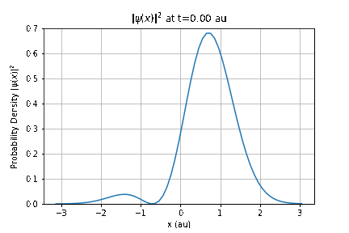
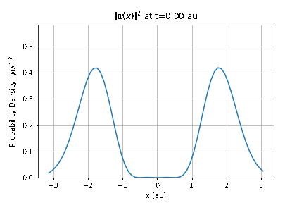

# Module 1: Learning the Schrödinger Equation
Karan Shah

-  **A summary**: This module can be used can be used for a Quantum Mechanics course. The module will begin with introduction to the time dependent Schrödinger Equation including a tutorial on analytical solutions for the  Quantum Harmonic Oscillator. The second portion of this module will consist of a solution of this system using neural networks. Students are encouraged to try different parameters and modify the code to fit other systems.

The module consists of following submodules:
- 00: A gentle interactive introduction to deep learning with a simple toy problem. Students will learn how to create neural network pipelines and develop qualitative understanding.
- 01: A broad introduction to different concepts in machine learning, with a focus on applications in physics. Numerous references are included for students to explore further.
- 02: An interactive notebook on solving 1D Quantum Harmonic Oscillator, consisting of two states in superposition evolving in time.




	
-   **What is included in this module?**: The following topics are expected:
    -   Lecture materials and hands-on lessons
    -   Exercises
    -   Homework/Project
-   **Which course(s) might these modules plug into?**
	-   Quantum Mechanics
-   **Physics and the data science learning goal(s):**
	-   Physics: The Schrödinger Equation (SE) is an important part of any Quantum Mechanics course and students are expected to solve it for increasingly complex systems throughout the course. In this module, I introduce Physics-Informed Neural Networks (PINNs) and demonstrate the effectiveness of numerical techniques and deep learning for solving the SE for Quantum Harmonic Oscillators. A good time to present this module would be after students solve the Time Independent Schrodinger Equation for QHOs and are being introduced to time dependent systems.

	- Data Science: PINNs [1,2] are a novel class of machine learning algorithms for solution of partial differential equations. This is achieved by incorporating structured prior information derived from physical laws into the learning algorithm. PINNs are constructed by encoding the constraints posed by a given differential equation and its boundary conditions into the loss function of a NN. This constraint guides the network to approximate the solution of the differential equation.


-   **Estimated amount of time these might take a student to complete**: 6 hours
-   **Estimated amount of time these might take a professor to teach**: 2 hours
-   **Pre-requisites:** 
    - [Core prerequisites](https://github.com/GDS-Education-Community-of-Practice/DSECOP/wiki/Core-prerequisites)
    - [Intro to Deep Learning Module by Fatemeh Bagheri](https://github.com/GDS-Education-Community-of-Practice/DSECOP/tree/main/Intro_to_Deep_Learning)

***Instructions for setting up the COLAB environment***

Click on "Open in Colab" button on any notebook. This will run the notebook on Google Colab.

Please use GPU for faster performance. You can check this by going in the "Runtime" menu in Colab, clicking on "Change Runtime Type" and setting "Hardware Accelerator" as "GPU".

***Instructions for setting up the LOCAL environment***

To set up the environment with conda:

Create new env:
`conda create -n dsecop_m1 python=3.8`

Activate the env:
`conda activate dsecop_m1`

Install required libraries:
```
conda install numpy matplotlib jupyter ipywidgets
conda install pytorch torchvision -c pytorch
```

Run `jupyter notebook` in this directory. A browser window will open where the notebooks can be viewed.

-   **References:**
    1. M. Raissi, P. Perdikaris, and G. E. Karniadakis. Physics-informed neural networks: A deep learning framework for solving forward and inverse problems involving nonlinear partial differential equations. Journal of Computational Physics, 378:686–707, February 2019.
    2. George Em Karniadakis, Ioannis G. Kevrekidis, Lu Lu, Paris Perdikaris, Sifan Wang, and Liu Yang. Physics-informed machine learning. Nature Reviews Physics, 3(6):422–440, June 2021
