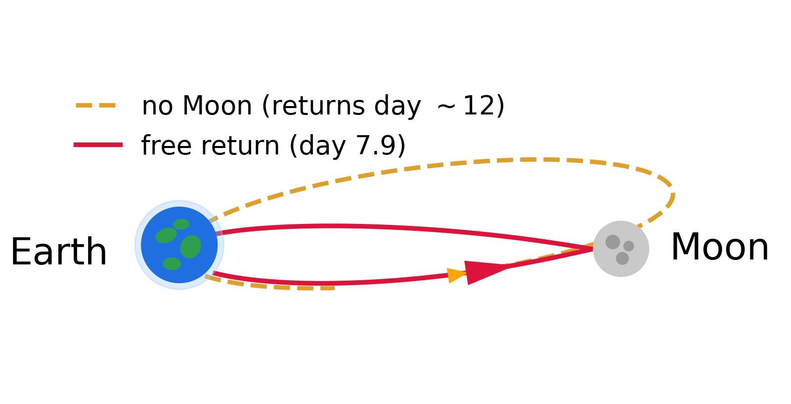

# Lunar Flyby with LLMs

This is a two-session computational module for the Kepler's-laws unit of an undergraduate classical-mechanics course. It is not a standalone project but roughly two class sessions that drop into the existing unit. Students implement orbital motion numerically and confront it with theory, anchored to a real, recent mission: the Artemis II crewed lunar flyby of April 2026, which used a free-return trajectory, the Moon's gravity, to swing the crew around the Moon and back to Earth.

In Notebook 1, students implement the two-body problem numerically and compare it with the analytic Kepler solution. In Notebook 2, they add the Moon as a third body, show how the restricted three-body problem departs from the closed Kepler orbit, and fly the real Artemis II free return from Orion's actual post-injection state: the simulated capsule reenters within about an hour of the real splashdown.

The module's data-science thread is the critical use of a large language model. Students write the physics (the equations of motion, the scaling, the conservation checks) and use a free LLM for the coding they have not yet been taught (the integrator, plotting, animation, unit conversion). Every LLM-written piece must pass given check cells, and one notebook plants an error in LLM-written code for students to find and classify. The module is model-agnostic and runs on free Google Colab.

### Key Words

Kepler's laws, two-body problem, restricted three-body problem, free-return trajectory, numerical integration (RK4, velocity-Verlet), conservation laws, nondimensionalization, scientific visualization, large language models, AI literacy, Artemis II

### Courses

Undergraduate classical mechanics, immediately after Kepler's laws and the two-body problem are introduced in lecture. Also suitable for a computational-physics course or a lab course with a computational component.

### Background Knowledge

Calculus, Newton's laws, and Kepler's laws (covered in lecture). Basic programming in one language; Python is assumed but no prior experience with numerical integration or plotting is required, since the data-science track builds it with the LLM. Students need a browser, a Google account for Colab, and access to any free-tier LLM (Claude, ChatGPT, or Colab's built-in Gemini).

### Estimated Amount of Time

Two sessions of 75 to 90 minutes each, worked in class with an LLM at hand. In testing, Notebook 1 took a student about 75 to 80 minutes and Notebook 2 about 105 minutes without the optional extension; in a 50-minute format, plan Notebook 2 as two sessions. The optional extension (the real Artemis II track from JPL Horizons, a rotatable 3D view, and the spacecraft's energy history) is best assigned as homework.

# Notebook Summary (Course Alignment Map)

|Notebook Title|Description|Data Science Learning Goals|Physics Learning Goals|
|--------------|-----------|---------------------------|----------------------|
|N1. The two-body problem | Students animate a sample Kepler orbit as a first LLM task, then build the two-body acceleration and a time-stepping integrator from a written specification and verify them against given check cells: a closed ellipse, conserved energy and angular momentum (with a step-halving table), and Kepler's third law measured from the simulated trajectory. A forward-Euler demo shows an integrator failing. A planted error in LLM-written code must be found, fixed, and classified. Conceptual questions cover the scaling, numerical error, and why Euler injects energy.  Total time: 75 to 90 min | DG1. Translate an itemized specification (function signatures, inputs, outputs) into working code with an LLM.  DG2. Implement a fixed-step integrator with an explicit state vector and update rule.  DG3. Validate code against a given benchmark and report the quantitative agreement (orbit closure, energy drift, its scaling with step size).  DG4. Locate, correct, and classify an error in LLM-written code as a software bug or a physics error.  DG5. Build an animated visualization of a trajectory. | PG1. State the two-body equations of motion and the analytic Kepler solution.  PG2. Work in scaled units: derive the natural time unit from the length unit and the gravitational parameter.  PG3. Verify a numerical orbit against theory: closed ellipse, conservation of energy and angular momentum, Kepler's third law. |
|N2. The three-body problem and a lunar flyby | Students add the Moon in two stages (Earth alone with a moving center, then Earth plus Moon) and fly the real Artemis II free return from Orion's post-injection state, comparing it with the same launch without the Moon. Given physics-check and telemetry-check cells verify the result. Students animate the flyby, convert the dimensionless run into mission telemetry (days, km, km/s), and detune the launch to see how sensitively the return depends on timing and speed. Optional extension: fetch the real Orion trajectory from JPL Horizons, plot it in 2D and 3D, and read its energy history to spot the engine burns.  Total time: 90 to 105 min, plus the extension as homework | DG1. Extend an integrator to a three-body system by building the acceleration in checkable stages.  DG2. Convert a dimensionless solution back to physical units and present it as a telemetry table.  DG3. Explore parameter sensitivity with knobs and interpret the sweep.  DG4. (Extension) Obtain public ephemeris data, plot it in 2D and 3D, and compare it with a simulation. | PG1. Implement the restricted three-body equations of motion.  PG2. Explain why the spacecraft's energy is not conserved in a time-dependent gravitational field, and why the no-Moon run still returns.  PG3. Demonstrate the free return: the Moon's gravity bends the path into a prompt, engine-off reentry, and a small change in launch speed or timing breaks it. |

## How to Run

Open a notebook in Google Colab (File, then Upload notebook) and run all cells. No local setup is needed: `numpy` and `matplotlib` are preinstalled, and only the optional extension installs one package (`astroquery`, the install line is given). A local Jupyter installation works identically. Students use an LLM in a separate browser tab and paste its code into the cells marked "build with LLM"; the notebooks say what to ask for and what the check cells must show.

## Assessment

Work and assessment happen in class. The instructor checks each specification live and asks for an explanation at the board, so understanding rather than a chatbot transcript is what is assessed. Suggested rubric: Notebook 1 two-body solution matching the analytic orbit (35%), Notebook 2 three-body solution and a working free return (35%), live explanation of the two-body versus three-body difference and the maneuver (20%), at least one LLM or implementation error located and classified (10%). For large sections, pair checkpoints or a short exit ticket can replace the board explanations.

## Materials

The two notebooks in this folder are the student versions: they give the physics and the verification cells and leave the code to "build with LLM", followed by conceptual questions. Notebook 2 supplies the integrator built in Notebook 1, so it runs on its own. Complete reference solutions and an instructor guide (timing, answer key, common LLM and student failure modes, assessment options) are available from the author.

## Real-World Anchor: Artemis II

On April 6, 2026, the crewed Artemis II mission flew past the Moon at about 6,500 km on a free-return trajectory, the first crewed flight beyond low Earth orbit since Apollo. Notebook 2 reproduces this physics in miniature. With Orion's real post-injection state as the initial conditions, the simulated craft reenters within about an hour of the real splashdown; without the Moon, the same launch is a bound orbit that drifts home only days later. NASA's mission pages and the public JPL Horizons ephemeris let students compare their simulation with the real flight.
