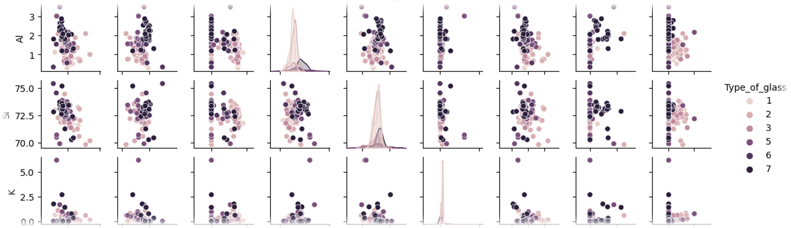

# Module Summary

This module introduces the basic concepts behind outlier analysis and dimensionality reduction.  
A classification dataset containing the index of refraction and chemical formula for six different kinds of 
glass is introduced (9 features total, 214 data points).  After performing preliminary analysis using a pair-wise plot to identify dependent and independent features, students 
will use PCA to reduce the dimensionality from 9 to 2.  The Z-score is introduced, calculated, and used to identify 
outlier data points.

### Key Words
Outlier analysis, dimensionality reduction, probability distribution, data visualization, index of refraction

### Courses
This notebook is recommended for an undergraduate course in optics, or in a lab course with a computational component.

### Background Knowledge
Students should be familiar with basic probability calculations including mean, variance, and standard deviation.  Students should be familiar with Snell's law and the index of refraction.

### Estimated Amount of Time
30 minutes

# Notebook Summary (Course Alignment Map)

|Notebook Title|Description|Data Science Learning Goals|Physics Learning Goal|
|--------------|-----------|---------------------------|---------------------|
