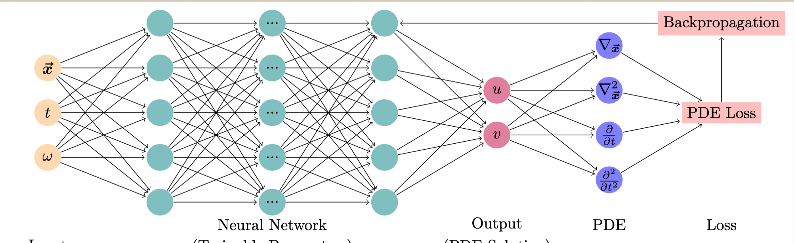

# Module 1: Learning the Schrödinger Equation
Karan Shah

-  **A summary**This module can be used can be used for a Quantum Mechanics course. The module will begin with introduction to the Schrödinger Equation including a tutorial on analytical solutions for different toy systems such as Particle-In-A-Box, Quantum Harmonic Oscillator etc. The second portion of this module will consist of a brief primer on numerical techniques for solving differential equations. Finally, deep learning will be introduced with code examples and students would be expected to compare the numerical and deep learning methods with the analytical solution for a system of their choice.

	
-   **What is included in this module?** The following topics are expected:
    -   Lecture materials and hands-on lessons: WIP
    -   Quizzes: TODO
    -   Homework: TODO
-   **Which course(s) might these modules plug into?**
	-   Quantum Mechanics
-   **Physics and the data science learning goal(s)**
	-   Physics: The Schr\"odinger Equation (SE) is an important part of any Quantum Mechanics course and students are expected to solve it for increasingly complex systems throughout the course. In this module, I introduce Physics-Informed Neural Networks (PINNs) and demonstrate the effectiveness of numerical techniques and deep learning for solving the SE with different potentials even in the absence of analytical solutions. This is especially important because SE becomes analytically intractable for even the smallest practical systems and formulations such as Density Functional Theory are used to simulate such systems. The time dependent Schrödinger Equation (TDSE) is (in atomic units)

    <!-- 
 -->

 where 
  is the Hamiltonian and $E$ is the total energy of the system.

- Data Science: PINNs [1,2] are a novel class of machine learning algorithms for solution of partial differential equations. This is achieved by incorporating structured prior information derived from physical laws into the learning algorithm. PINNs are constructed by encoding the constraints posed by a given differential equation and its boundary conditions into the loss function of a NN. This constraint guides the network to approximate the solution of the differential equation.
{#fig:pinn
width="\\linewidth"}
-   **Estimated amount of time these might take a student to complete**: 6 hours
-   **Estimated amount of time these might take a professor to teach**: 2 hours
-   **Pre-requisites:** 
    - [Core prerequisites](https://github.com/GDS-Education-Community-of-Practice/DSECOP/wiki/Core-prerequisites)
    - Common resources for diff eqs and PINNs by Julie and Karan
-   **References**
    1. M. Raissi, P. Perdikaris, and G. E. Karniadakis. Physics-informed neural networks: A deep learning framework for solving forward and inverse problems involving nonlinear partial differential equations. Journal of Computational Physics, 378:686–707, February 2019.
    2. George Em Karniadakis, Ioannis G. Kevrekidis, Lu Lu, Paris Perdikaris, Sifan Wang, and Liu Yang. Physics-informed machine learning. Nature Reviews Physics, 3(6):422–440, June 2021