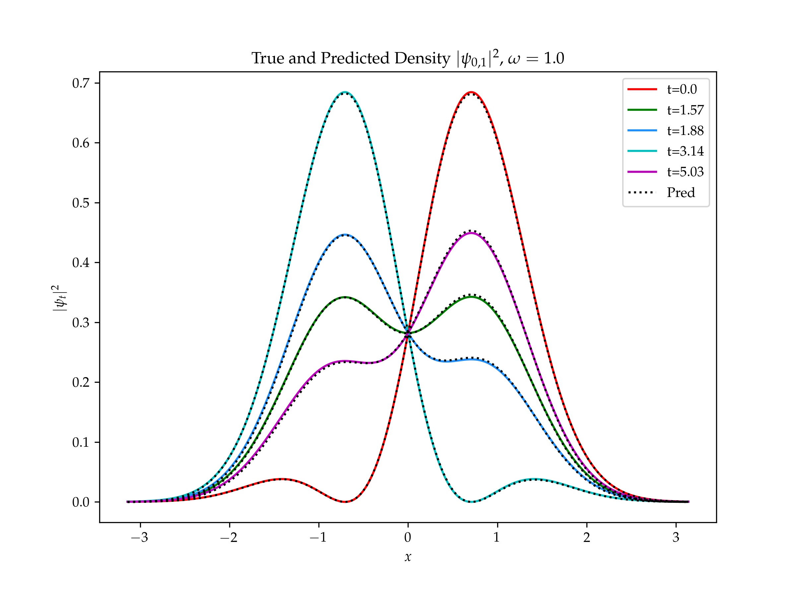

---
bibliography:
- dsecop.bib
---

# Physics-Informed and Data-Driven methods for Pedagogical Toy Models

Karan Shah\
DSECOP

::: {#module-1-Schr\\\"odingers-equation}
## Module 1: ML based solution for the Schrödinger Equation {#module-1-Schr\\\"odingers-equation}
:::

::: {#summary1}
### Summary: {#summary1}
:::

This module can be used can be used for a Quantum Mechanics course. The
module will begin with introduction to the Schrödinger Equation
including a tutorial on analytical solutions for different toy systems
such as Particle-In-A-Box, Quantum Harmonic Oscillator etc. The second
portion of this module will consist of a brief primer on numerical
techniques for solving differential equations. Finally, deep learning
will be introduced with code examples and students would be expected to
compare the numerical and deep learning methods with the analytical
solution for a system of their choice.

::: {#description}
### Description:
:::

#### Physics

The Schrödinger Equation (SE) is an important part of any Quantum
Mechanics course and students are expected to solve it for increasingly
complex systems throughout the course. In this module, I introduce
Physics-Informed Neural Networks (PINNs) and demonstrate the
effectiveness of numerical techniques and deep learning for solving the
SE with different potentials even in the absence of analytical
solutions. This is especially important because SE becomes analytically
intractable for even the smallest practical systems and formulations
such as Density Functional Theory are used to simulate such systems. The
time dependent Schrödinger Equation (TDSE) is (in atomic units)
$$\hat{H} \psi(\mathbf{r}, t)=i \frac{\partial \psi(\mathbf{r}, t)}{\partial t}$$
with time independent case (TISE)
$$\hat{H} \psi(\mathbf{r})= E \psi(\mathbf{r})$$ where $\hat{H}$ is the
Hamiltonian and $E$ is the total energy of the system.

#### ML

PINNs
[@raissiPhysicsinformedNeuralNetworks2019c; @karniadakisPhysicsinformedMachineLearning2021a]
are a novel class of machine learning algorithms for solution of partial
differential equations. This is achieved by incorporating structured
prior information derived from physical laws into the learning
algorithm. PINNs are constructed by encoding the constraints posed by a
given differential equation and its boundary conditions into the loss
function of a NN. This constraint guides the network to approximate the
solution of the differential equation.

{#fig:pinn
width="\\linewidth"}

Relevant courses: Quantum Mechanics\
Computational/ML topics covered: Numerical techniques for solving PDEs,
Neural Networks, Physics-Informed Neural Networks, Gaussian Processes

::: {#representative-system}
### Representative system:
:::

#### Time Dependent Schrödinger Equation

Quantum Harmonic Oscillator is a representative system commonly used in
QM courses. In the 1D case, the Hamiltonian is (atomic units)

$$\hat{H_x}=-\frac{1}{2}\frac{\partial^{2}}{\partial x^{2}}+\frac{\omega^{2}}{2}x^{2}$$

The analytical solution $\psi(x,t) \in \mathbb{C}$ is
$$\psi_{m,n}(x,t) = \frac{1}{\sqrt{2}}\left( e^{\left(-i E_m t\right)}\phi_m(x) + e^{\left(-i E_n t\right)}\phi_n(x)\right)$$
where $\psi_{m,n}$ is the wavefunction for a QHO consisting of the
superposition of eigenstates $\phi_m$ and $\phi_n$ with $E_i$ being the
energy level of state $\phi_i$.

$$\phi_0(x) = \sqrt[4]{\frac{\omega}{\pi}}\exp\left(-\frac{\omega x^2}{2}\right)$$
$$\phi_n(x) = \phi_0(x) \frac{1}{\sqrt{2^n n!}}Her_n(\sqrt{\omega}x)\exp\left(-i E_n t\right)$$
where $Her_n(y)$ is the $n$th Hermite polynomial, and phase
$\exp\left(-i E_n t\right)$ where $E_n = (n+\frac{1}{2})\omega$

::: {#sample-questions}
### Sample questions:
:::

1.  Derive the analytical solution for QHO.

2.  1.  Write a simple numerical solver (eg Runge-Kutta) to simulate the
        time evolution of this QHO system.

    2.  Implement a simple neural network as a surrogate model for this
        system. How would you represent a complex valued wavefunction in
        a neural network? (started code for neural network will be
        provided)

    3.  Now add the Physics-Informed regularization term to the simple
        neural network implemented in part (b).

    4.  Compare the results from approaches (a),(b) and (c) with the
        analytical solution.

3.  TISE is an eigenvalue problem. How would you incorporate further
    constraints into PINNs to get solutions for specific eigenstates?

4.  What are the advantages and disadvantages of ML models like PINNs
    over traditional numerical solvers?

::: {#sample-simulation}
### Sample simulation:
:::

This figure shows results inferred with a PINN for the 1D TD QHO system:

{#fig:pinn2 width="0.6\\linewidth"}

{#fig:pinn3
width="0.6\\linewidth"}

::: {#extensions}
### Extensions:
:::

-   Content about Bayesian statistics can be incorporated by using a
    Gaussian Process based surrogate model for the Schrödinger equation.
    Example: [
    https://karan.sh/GPNN_schrodingers_equation/](https://karan.sh/GPNN_schrodingers_equation/)

-   Because of the relevance of differential equations to different
    physical systems, this module can be extended to multiple courses
    like Classical Mechanics and Electrostatics/dynamics.
